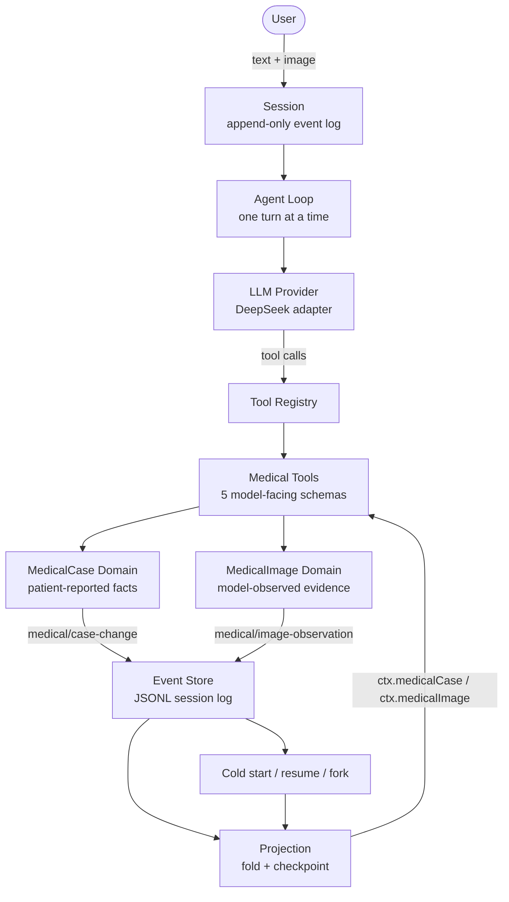
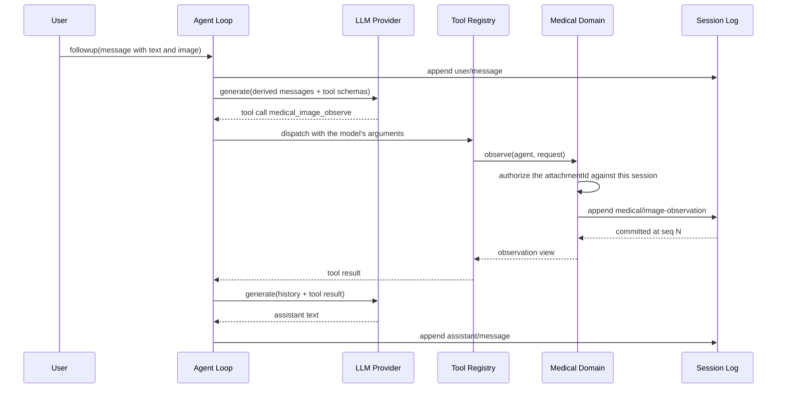

# MedHarness architecture

English | [中文](medharness-architecture.zh.md)

## Summary

MedHarness is a medical intake agent built by extending the DeepSeek Harness runtime, not by writing an agent runtime of its own. The harness supplies the loop, the session log, the tool registry, the projection registry, and the provider adapters; this project adds two domain services, five model-facing tools, one profile composition, and an evaluation harness. This page maps the seam between the two halves.

## Table of Contents

- [What the harness provides](#what-the-harness-provides)
- [What MedHarness adds](#what-medharness-adds)
- [The composition](#the-composition)
- [One request, end to end](#one-request-end-to-end)
- [Why this architecture](#why-this-architecture)
- [Package map](#package-map)
- [Dev Note](#dev-note)

-----

## What the harness provides

Everything in this section exists before MedHarness does, and none of it is forked.

| Capability | Where it lives | What it gives the extension |
|---|---|---|
| Plugin runtime | `vendor/` (vendored Cordis) | `Context`, `ctx.plugin()`, `ctx.effect()`, service injection, and lifecycle disposal |
| Agent loop | `packages/core/agent-loop` | One turn: assemble a request, call the model, dispatch tool calls, commit the turn to the session |
| Session + event log | `packages/core/session` | `SessionEvent`, `agent.session.append()`, `snapshotEvents()`, `deriveMessages()` |
| Projection registry | `packages/session/session-projection` | A registered fold from events to a read model, with checkpoint caching |
| Tool registry | `packages/core/tools` | `ctx.tools.register()`, the model-facing JSON schema, and dispatch |
| LLM providers | `packages/llm` | `LlmService`, adapters, `resolveModelInfo()`, image-block serialization |
| Attachments | `packages/attachment` | `AttachmentStore.admitPromptContent()`, the canonical `ImageAttachmentRef` |
| Durable persistence | `packages/session/session-persistence-jsonl` | The append-only log, the read path, and its event-type validation |
| Composition | `packages/boot/app-boot` + `packages/bundle/*` | Profiles, bundles, `cordis.yml`, and the loader that settles them |

The harness is deliberately generic. It knows about sessions, turns, tools, and events; it knows nothing about cases, images, or medicine.

## What MedHarness adds

Four additions, all of them plugins:

| Addition | Package | Registers |
|---|---|---|
| Patient-reported case domain | `medical-case` | `ctx.medicalCase`, the `medical/case-change` event, the `medicalCase` projection |
| Model-observed image domain | `medical-image` | `ctx.medicalImage`, the `medical/image-observation` event, the `medicalImage` projection |
| Five model-facing tools | `tool-medical-*` | `medical_case_intake`, `medical_case_update`, `medical_case_get`, `medical_image_observe`, `medical_image_get` |
| Composition + evaluation | `bundle/medharness`, `medical-eval` | The `medharness` / `medharness-web` profiles, and the golden-case harness |

The domain capability is implemented entirely through seams the harness already publishes, which is why it can be mounted beside other bundles or left out entirely. One shared path outside the domain was changed, and it is listed here rather than glossed over: `requestImageHandleText` in `dsh-llm` was rewritten so the model-facing image handle names the attachment id as an explicit field. That is a generic projection path used by every image-capable provider, not a medical one, and it changed because a live model could not reliably copy the old format.

## The composition

Read the diagram as two loops sharing one spine. The outer loop is the conversation: a user message becomes a turn, the turn calls the model, the model calls tools. The inner loop is durability: every mutation a tool makes is appended to the session log, folded back into a projection, and served to the next turn — and to a process that starts tomorrow.

The two domains never touch each other. A visible finding cannot become a reported symptom, because they are different events folded by different projections into different services.

## One request, end to end

The authorization step is the load-bearing one. The model sends an `attachmentId` string; the domain looks up what the session's own user message actually carried and refuses anything else. A model cannot invent an image, and it cannot cite an image belonging to another session.

## Why this architecture

**The loop is not the interesting problem.** An agent loop is a while-loop around a model call and a tool dispatch. Reimplementing it would produce a worse version of something that already handles cancellation, streaming, retries, inbox ordering, turn boundaries, and crash recovery. MedHarness spends its complexity budget on the domain instead.

**Domain state belongs in the domain, not in the transcript.** A chat message is prose. Nothing validates it, nothing prevents the model from contradicting an earlier one, and nothing survives a context-window compaction. A case that exists only as conversation is a case you cannot query, cannot diff, and cannot trust. Putting it in an event-sourced projection makes it a fact with a revision number.

**MedHarness reuses the runtime persistence, projection, and replay infrastructure rather than implementing a second recovery subsystem.** Persistence, resume, and fork inheritance are not features this project implemented; they follow from the state living in the session log, and the projection is rebuilt from events, so a process that restarts reconstructs the state the previous one had and can explain how it got there. What that does not remove is the maintenance. An event schema change still has to be regenerated, catalogued, and acknowledged through the compatibility process; the persistence catalog still has to be kept fresh; and the read path still refuses an event type the build does not know, which makes the generated vocabulary a live dependency rather than a one-time setup step.

**The tool schema is the prompt.** With five tools and a pinned persona, the entire model-facing surface is about 2,174 tokens. There is no shell, no filesystem, and no web search in this composition, because a medical intake has no use for them and every added row is both a wider request and a wider attack surface.

**Evaluation has to judge the trajectory, not the reply.** An assistant sentence saying "I recorded your symptoms" proves nothing. The harness asserts what the runtime actually did: which tool was called, what the case revision became, whether a durable event was appended. That is the difference between a demo and a system.

## Package map

| Package | Role |
|---|---|
| `packages/medical/medical-case` | One durable case per session: create, restate, patch, strict replay, monotonic revision |
| `packages/medical/medical-image` | One observation per attached image per session, addressed by canonical attachment id |
| `packages/medical/tool-medical-case-intake` | Records the case on first contact and reports the required fields still missing |
| `packages/medical/tool-medical-case-update` | Applies one incremental change, never clearing a field silently |
| `packages/medical/tool-medical-case-get` | Reads the authoritative case and the remaining gaps, changing neither |
| `packages/medical/tool-medical-image-observe` | Records what the model directly saw in one image, with quality limits and uncertainty |
| `packages/medical/tool-medical-image-get` | Reads observations back, addressed by attachment |
| `packages/medical/medical-eval` | Golden-case replay, the pure evaluator, the failure taxonomy, and the report |
| `packages/bundle/medharness` | The standalone profile: runtime scaffolding plus the medical rows, and nothing else |

## Dev Note

Working context for maintainers — click to expand

The domain packages deliberately do not import `dsh-agent-loop`. They compose from plugins, `Agent` verbs, and session events, so the default loop implementation has no privileged copy of them — the same reason the same-session goal domain is built this way. A different loop could mount the same two services unchanged.

The image domain was added a phase after the case domain and reuses none of its code. That is intentional: the two share a shape (session-backed, event-sourced, projection-read) but not a vocabulary, and merging them would have forced a single event to mean both "the patient said this" and "the model saw this".

