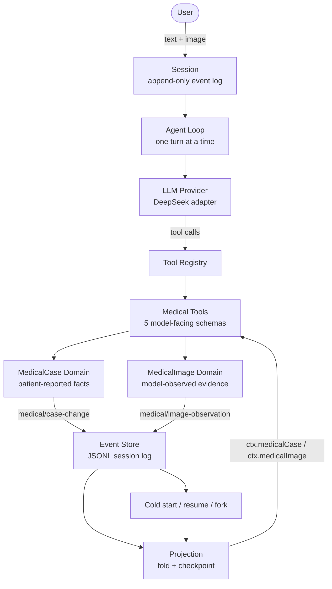
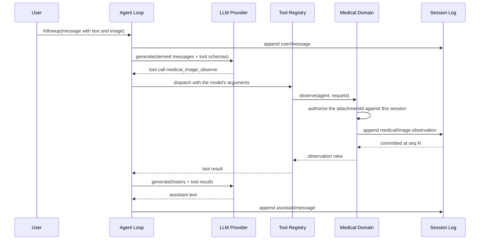

# MedHarness 架构

[English](medharness-architecture.md) | 中文

## 概述

MedHarness 是一个通过扩展 DeepSeek Harness 运行时构建出来的医疗接诊 Agent，而不是自己写一套 Agent 运行时。harness 提供 loop、会话日志、工具注册表、投影注册表与模型适配器；本项目增加两个领域服务、五个模型可见工具、一份 profile 组合，以及一套评测框架。本页说明这两半之间的接缝。

## 目录

- [harness 提供了什么](#what-the-harness-provides)
- [MedHarness 增加了什么](#what-medharness-adds)
- [整体组合](#the-composition)
- [一次请求的完整链路](#one-request-end-to-end)
- [为什么选择这种架构](#why-this-architecture)
- [包地图](#package-map)
- [开发备注](#dev-note)

-----

## harness 提供了什么

本节的一切在 MedHarness 出现之前就已存在，没有任何一处被 fork。

| 能力 | 所在位置 | 它为扩展提供了什么 |
|---|---|---|
| 插件运行时 | `vendor/`（vendored Cordis） | `Context`、`ctx.plugin()`、`ctx.effect()`、服务注入与生命周期释放 |
| Agent Loop | `packages/core/agent-loop` | 一轮的含义：组装请求、调用模型、分发工具调用、把本轮提交进会话 |
| Session 与事件日志 | `packages/core/session` | `SessionEvent`、`agent.session.append()`、`snapshotEvents()`、`deriveMessages()` |
| 投影注册表 | `packages/session/session-projection` | 注册「事件到读模型」的折叠，并带检查点缓存 |
| 工具注册表 | `packages/core/tools` | `ctx.tools.register()`、模型可见的 JSON schema、以及分发 |
| 模型提供方 | `packages/llm` | `LlmService`、适配器、`resolveModelInfo()`、图像块序列化 |
| 附件 | `packages/attachment` | `AttachmentStore.admitPromptContent()`、canonical `ImageAttachmentRef` |
| 持久化 | `packages/session/session-persistence-jsonl` | 追加式日志、读取路径及其事件类型校验 |
| 组合 | `packages/boot/app-boot` + `packages/bundle/*` | profile、bundle、`cordis.yml`，以及负责落地的 loader |

harness 刻意保持通用。它知道会话、轮次、工具与事件；它不知道病例、图像或医学。

## MedHarness 增加了什么

四项新增，全部是插件：

| 新增 | 包 | 注册内容 |
|---|---|---|
| 患者陈述的病例领域 | `medical-case` | `ctx.medicalCase`、`medical/case-change` 事件、`medicalCase` 投影 |
| 模型观察的图像领域 | `medical-image` | `ctx.medicalImage`、`medical/image-observation` 事件、`medicalImage` 投影 |
| 五个模型可见工具 | `tool-medical-*` | `medical_case_intake`、`medical_case_update`、`medical_case_get`、`medical_image_observe`、`medical_image_get` |
| 组合与评测 | `bundle/medharness`、`medical-eval` | `medharness` / `medharness-web` profile，以及黄金用例框架 |

领域能力完全通过 harness 本就公开的接缝实现，因此它既能和别的 bundle 并存，也能被整体摘掉。领域之外有一条共享路径被改过，这里如实列出而不是含糊过去：`dsh-llm` 的 `requestImageHandleText` 被重写，让面向模型的图像 handle 把 attachment id 写成显式字段。那是一条被所有具备图像能力的 provider 共用的通用投影路径，不是医疗专用路径；它之所以改，是因为真实模型无法可靠照抄旧格式。

## 整体组合

这张图要读成「两个环共用一根脊柱」。外环是对话：用户消息变成一轮，该轮调用模型，模型调用工具。内环是持久性：工具做出的每一次变更都追加进会话日志、折回投影、并服务给下一轮 —— 以及服务给明天才启动的进程。

两个领域彼此永不相交。可见发现不可能变成患者陈述的症状，因为它们是不同的事件、由不同的投影折叠进不同的服务。

## 一次请求的完整链路

承重的是授权那一步。模型发来一个 `attachmentId` 字符串；领域去查该会话自己的用户消息究竟携带过什么，其余一律拒绝。模型无法凭空发明一张图，也无法引用属于另一个会话的图。

## 为什么选择这种架构

**loop 不是真正有意思的问题。** 一个 agent loop 就是「模型调用 + 工具分发」外面套一层 while。重写它只会得到一个更差的版本，而现成版本已经处理了取消、流式、重试、inbox 顺序、轮次边界与崩溃恢复。MedHarness 把复杂度预算花在领域上。

**领域状态属于领域，不属于对话记录。** 一条聊天消息是散文。没有东西校验它，没有东西阻止模型与更早的一条自相矛盾，也没有东西能在上下文压缩后幸存。只作为对话存在的病例，是你无法查询、无法 diff、也无法信任的病例。把它放进事件溯源投影，它才成为一个带修订号的事实。

**MedHarness 复用运行时的持久化、投影与重放基础设施，而不是再实现一套恢复子系统。** 持久化、resume 与 fork 继承都不是本项目实现的功能；它们源于「状态住在会话日志里」，而投影由事件重建，所以重启后的进程能重建出前一个进程的状态，并解释它是怎么走到那里的。但这**并没有免掉维护**：事件 schema 变更仍然必须重新生成、编目，并按兼容性流程记录；persistence catalog 仍然必须保持新鲜；读取路径仍然会拒绝本构建不认识的事件类型 —— 也就是说，那张生成的已知事件表是一个**持续存在的依赖**，不是一次性的初始化步骤。

**工具 schema 就是提示词。** 五个工具加一段固定人设，整个模型可见面约 2,174 tokens。这个组合里没有 shell、没有文件系统、没有联网搜索，因为医疗接诊用不上它们，而每增加一行既意味着更宽的请求，也意味着更大的攻击面。

**评测必须判定轨迹，而不是回复。** 一句「我已记录您的症状」证明不了任何事。harness 断言的是运行时实际做了什么：调用了哪个工具、病例修订号变成了几、有没有追加一条持久事件。这就是 demo 与系统的区别。

## 包地图

| 包 | 职责 |
|---|---|
| `packages/medical/medical-case` | 每个会话一份持久病例：创建、重述、增量修改、严格重放、单调修订号 |
| `packages/medical/medical-image` | 每个会话每张附加图像一份观察，按 canonical attachment id 寻址 |
| `packages/medical/tool-medical-case-intake` | 首次接触时记录病例，并报告仍缺失的必填字段 |
| `packages/medical/tool-medical-case-update` | 施加一次增量修改，绝不静默清空字段 |
| `packages/medical/tool-medical-case-get` | 读回权威病例与剩余缺口，两者都不改动 |
| `packages/medical/tool-medical-image-observe` | 记录模型在某张图中直接看到的内容，含质量限制与不确定项 |
| `packages/medical/tool-medical-image-get` | 按附件读回观察记录 |
| `packages/medical/medical-eval` | 黄金用例回放、纯函数 Evaluator、失败分类法，以及报告 |
| `packages/bundle/medharness` | 独立 profile：运行时脚手架加医疗行，别的一概不要 |

## 开发备注

维护者工作上下文 —— 点击展开

领域包刻意不 import `dsh-agent-loop`。它们由插件、`Agent` 动词与会话事件组合而成，因此默认的 loop 实现对它们没有特权副本 —— 这与同会话 goal 领域采用同一做法是同一个理由。换一个 loop 也能原样挂载这两个服务。

图像领域比病例领域晚一个阶段加入，且没有复用它的任何代码。这是刻意的：两者共享一个形状（会话支撑、事件溯源、投影读取），但不共享词汇；把它们合并会逼着单个事件同时表示「患者说了这个」与「模型看到了这个」。

