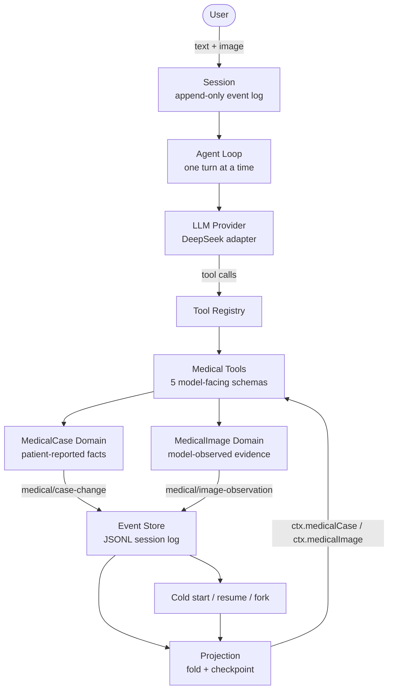
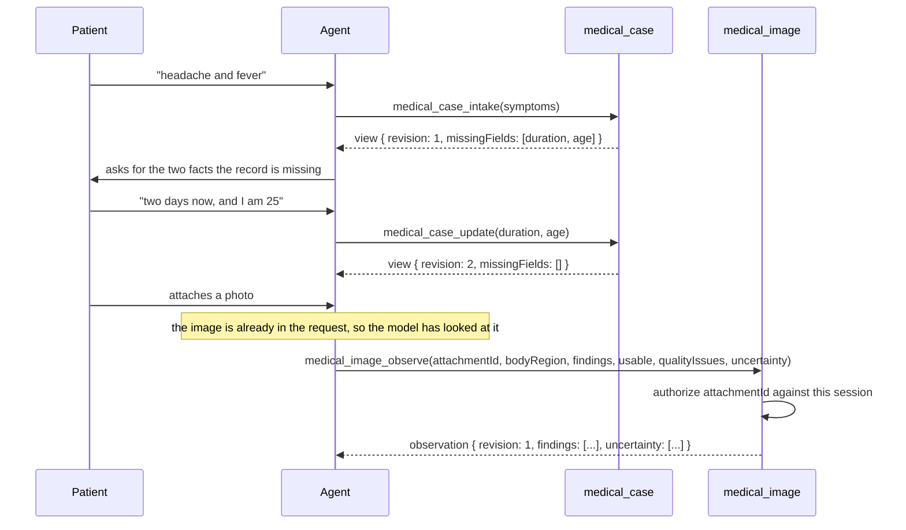

# MedHarness

A medical intake agent built by **extending an agent runtime**, not by calling a model API: two event-sourced domain services, five model-facing tools, a five-tool runtime profile, and a trajectory-level reliability harness — all mounted as plugins onto DeepSeek Harness.

English | [中文](README.zh.md)

## Motivation

Bolting an LLM onto a clinical workflow fails in four specific ways, and none of them are about model quality.

**State is unreliable.** The obvious place to keep a patient's case is the conversation. A chat message has no schema, so nothing validates it; it is re-derived from a growing transcript, so a compaction silently drops facts; and it is model-authored as often as user-authored, so the record and the model's summary of the record drift apart with nothing to arbitrate. An agent whose job is to *not* invent facts needs a record it can prove.

**Multi-turn context drifts.** Turn five contradicts turn two and nothing notices. There is no revision number to compare, no event to point at, and no way to ask what the case looked like before a correction.

**Image references are wrong.** When a model can see images it must send an identifier back to record what it saw. In practice it sends the display name, a digest with its prefix stripped, a filesystem path — anything but the identifier. An agent that can cite an attachment it never received can fabricate evidence, and one that can cite another session's attachment can read across a tenant boundary.

**Nothing is verifiable.** "I have recorded your symptoms and your age" is a sentence that costs nothing to produce and proves nothing. The failure that matters is silent: the reply is fluent, the case revision never moved, and the transcript looks fine.

MedHarness answers each of those structurally rather than by asking the model to behave: domain state in an event-sourced projection, evidence separated by who is speaking, attachment identity authorized against the session, and evaluation that judges the trajectory instead of the reply.

## Architecture



The agent loop is not reimplemented. DeepSeek Harness supplies the loop, the session log, the tool registry, the projection registry, and the provider adapters; MedHarness implements its domain capability through the plugin seams those already publish, and the extension can be unmounted without changing the runtime. One source-level change to the harness did come out of this work, and it is worth stating precisely: the generic model-facing image handle in `dsh-llm` now names the attachment id as an explicit field, because a live model could not reliably copy the old format. That is a change to one shared projection path, not to the loop, and it is the only one.

Read the diagram as two loops sharing one spine: the outer loop is the conversation, the inner loop is durability. Full walkthrough in [the architecture page](../docs/medharness-architecture.md).

## Example Workflow

A pre-consultation intake, from a symptom sentence to a structured record that another system can read. This is **structured evidence capture**, not diagnosis: the agent collects what the patient states and records what is visible in an attached photo, and nothing here produces a clinical conclusion.



Three things in that diagram are the point.

**The gap report drives the conversation.** `medical_case_intake` returns `missingFields` computed from the record, so the follow-up question is derived from what is absent rather than guessed. When the patient supplies the last required field, the list is empty and the agent stops asking.

**The case and the observation are different records with different owners.** The case holds what the patient stated; the observation holds what the model saw. The second can never become the first — there is no parameter that would let it, and the two are folded by different projections.

**The medical domain and tool layer never handle image bytes directly.** The harness attachment and provider pipeline is what puts the image in front of the model; `medical_image_observe` only records the structured observation the model returns, keyed by an attachment id the session authorizes. The domain never re-reads, re-encodes, or stores an image.

What a downstream reader gets is not a transcript. It is a revisioned case record plus observations addressed by attachment, both reconstructible from the session log by replay.

## Core Features

**1. Medical Agent Runtime.** A standalone profile (`dsh --profile medharness`) whose entire model-facing surface is five medical tools. No shell, no filesystem, no web search, no subagents, no telemetry — not disabled, absent.

| | tools in `request/header.tools` | tool-schema size |
|---|---|---|
| over the base coding bundle | **27** | 29,612 bytes ≈ **7,403 tokens** |
| `medharness` | **5** | 8,696 bytes ≈ **2,174 tokens** |

**2. Structured Medical Domain.** `medical-case` keeps one durable case per session — symptoms, duration, age, notes, and a monotonic revision — and derives `missingFields` on every read so the agent asks for what is absent instead of inferring it. No update parameter can clear a field, so a follow-up answer can never erase an earlier one.

**3. Multimodal Observation Pipeline.** `medical-image` records what the model directly saw in an attached image: body region, visible findings, a `usable` verdict with closed-enum quality issues, and an explicit `uncertainty` list. Attachments are authorized against the session's own messages, so a model cannot cite an image that was never attached to it.

**4. Persistent Session State.** Both domains are event-sourced into the session log and read back through registered projections. Persistence, cold start, resume, and fork inheritance are consequences of that, not features bolted on: a restarted process replays the log and reconstructs the same state with no migration and no side store.

**5. Evaluation Framework.** Golden cases replay through the **real** agent loop — only the model is scripted — and are judged on routing, case state, revision, mutation, and tool errors rather than on the assistant's prose. A live mode runs the same roster against the shipped composition and refuses to report numbers if the runtime it booted is not the one that ships.

## Engineering Challenges

**Attachment grounding.** The hardest problem here, and the one with a security boundary behind it. A live run against a real vision model answered a single `medical_image_observe` call four different ways — the display name, the digest without its `sha256:` prefix, the fixture id, and the normalized-copy filesystem path — and every one was correctly refused. The fix was three-layered: the store mints the identity (content-addressed, never caller-asserted), the domain authorizes the claimed id against the session's own messages, and the handle the model reads was rewritten so the identifier leads, is quoted, keeps its prefix, and is labelled — with the display name explicitly marked display-only. Six near-miss identities have tests that require refusal while the canonical id still succeeds.

**Event schema evolution.** Adding a session event type is not local. The generated event vocabulary, the persistence catalog, the schema inventory, and the recorded compatibility history all have to move together, and the read path is fail-closed: an event type the build does not know refuses the entire log rather than being skipped. That is the right default — silently dropping an authoritative domain record reconstructs a wrong session — but it means a missing generated entry makes a build unable to read a log it wrote itself. One did, and the fix was a one-line regeneration plus a recorded `same-version` compatibility decision.

**Replay compatibility.** Every mutation event carries the **complete post-mutation value**, never a delta, so computing the current value never requires merging a delta with an earlier payload — which is what keeps last-wins projection and strict replay in agreement. Strict replay still consumes the events in sequence, because a snapshot cannot carry every invariant on its own: the operation that produced the record, the case identity, revision continuity, and `createdAt` ordering are all checked against what came before. Projections declare a `stateVersion`, and a persisted checkpoint from an older unit is discarded rather than forward-applied.

**Model uncertainty handling.** An LLM asked about a skin photograph will diagnose it. Rather than claim to eliminate that, the system removes the fields a conclusion would go in: there is no diagnosis, treatment, medication, risk, urgency, or confidence parameter, and a test asserts none is ever added. What remains is `usable` (this image cannot be assessed), closed-enum `qualityIssues`, and a required `uncertainty` list — so "I do not know" is a recorded outcome rather than an omission.

**Composing a minimal surface.** The profile is a standalone tree, not the base bundle with rows switched off: composing subtractively would still install, resolve, and version every coding-agent package. Three decisions from that audit are worth recording. *A row another row injects is not a surface* — process confinement and the filesystem provider stay because other rows inject them, while no shell or filesystem **tool** is declared. *Telemetry cannot be switched off from configuration*, so the row is absent rather than disabled; a profile that does not mount it cannot export. *A bare package specifier only resolves if the bundle declares it*, because the module-fallback walk mirrors the dependency closure of the installation anchor — which is why the bundle's rows name packages rather than source paths.

## Evaluation

```sh
pnpm medharness:eval                                    # the three-case live smoke
pnpm medharness:eval --case get-reads-without-changing  # one named case
pnpm medharness:eval --all                              # the whole roster, images included
```

A run reports dimensions side by side rather than collapsing into a score:

```text
profile=medharness provider=deepseek-official model=deepseek-flash runner=live
cases=1/1 passed routing=1/1 state=3/3 missingFields=1/1
image=6/6 imageMutation=3/3 unexpectedImageMutations=0
toolErrors=0 unexpectedMutations=0 timeouts=0 runtimeErrors=0
usage input=3519 output=1964 turns=1/1 complete=true
latency totalMs=13254
```

A failing run names the failure instead of hiding it — the taxonomy, both values, and the session sequences to look up in the durable log:

```text
FAIL image-live-smoke-visible-patch
  turn 0: IMAGE_OBSERVATION_MISMATCH — the expectation describes an observation of
          "image-1", but this session holds none for that image
  turn 0: EXPECTED_IMAGE_MUTATION_MISSING — durable image change must be true; the turn produced false
```

The offline suite is the same evaluator without a provider:

```sh
pnpm vitest run packages/medical
```

Design rationale for each mechanism is in [the engineering design page](../docs/medharness-engineering-design.md).

## End-to-end Acceptance

The behaviours below are asserted today, each by a test that fails if it regresses. The cold-start and catalog entries were added after a real failure, described in [the engineering design page](../docs/medharness-engineering-design.md).

| # | Behaviour | Asserted by |
|---|---|---|
| T01 | **Persistence catalog** — every declared domain event is in the generated known-event vocabulary, so a build can read the log it writes | `packages/medical/medical-image/tests/persistence.spec.ts` |
| T02 | **Cold resume / replay** — a session written by one process is opened by another, replayed, and resumed with its state intact | `packages/medical/medical-image/tests/persistence.spec.ts` |
| T03 | **Multi-image isolation** — two images in one session keep two independent observations, addressed separately | `golden/013-image-observe-two-images.json` |
| T04 | **Read-only does not mutate** — a read tool leaves the revision and the log untouched | `golden/007-get-reads-without-changing.json` |
| T05 | **Identical snapshot is a no-op** — re-submitting the same observation appends no event and moves no revision | `golden/011-image-observe-restatement-is-a-noop.json` |
| T06 | **Full-snapshot update** — a changed observation advances the revision and records the whole new value | `golden/012-image-observe-update-advances-revision.json` |
| T07 | **Attachment authorization** — the canonical id succeeds; six near-miss identities are refused, including another session's | `packages/medical/medical-image/tests/service.spec.ts` |
| T08 | **Low-quality image and uncertainty** — an unusable image is recorded as unusable with its quality issues, not guessed at | `golden/010-image-observe-unusable-image.json` |

The durable stream those behaviours produce looks like this. Event names and payload fields are exactly as the code writes them; the sequence numbers are illustrative, because they depend on how many turns precede the observation.

```text
seq   1  turn/start
seq   2  user/message                 text + image block carrying the canonical attachment id
seq   3  tool/call                    medical_image_observe
seq   4  medical/image-observation    operation=observe  revision=1  findings=[...]  uncertainty=[...]
seq   5  tool/result                  changed=true

seq   N  tool/call                    medical_image_observe   (identical snapshot)
          -> no medical/image-observation record; revision stays 1; changed=false

seq   M  tool/call                    medical_image_observe   (changed snapshot)
seq   M  medical/image-observation    operation=update   revision=2  findings=[...]  uncertainty=[...]
```

Two properties are worth reading off that timeline. A no-op is **not** established by the absence of a record on its own — the call may simply never have happened. The evidence is all three together: the `medical_image_observe` call, no corresponding `medical/image-observation` record, and a revision that did not move. That is exactly what the T05 case asserts, and it is why the mutation expectation checks the event count rather than only the resulting state. And because every mutation record is a whole value, computing the current observation from a later record never requires merging it with an earlier one; a strict fold still walks the sequence to check the invariants a snapshot cannot carry.

## Scope and non-goals

Several large subsystems are mounted by no bundle — SSH, browser-use, computer-use, desktop, `experimental/`, `benchmarks`, `website`, `native/system` — so they cost nothing at runtime. Removing them from the repository is a size decision with its own build-system blast radius, and nothing was removed for this project.

Nothing here diagnoses, prescribes, or assesses risk, and the design deliberately gives the model no field in which to try. That bounds what the system stores and acts on; it does not stop a model from writing a clinical claim in a chat sentence, and the project does not claim otherwise.

## Repository layout

| Path | Role |
|---|---|
| [`packages/medical/medical-case`](../packages/medical/medical-case/README.md) | Patient-reported case domain and its projection |
| [`packages/medical/medical-image`](../packages/medical/medical-image/README.md) | Model-observed image domain and its projection |
| [`packages/medical`](../packages/medical/README.md) | The five model-facing tools and the group map |
| [`packages/medical/medical-eval`](../packages/medical/medical-eval/README.md) | Golden cases, evaluator, failure taxonomy, report |
| [`packages/bundle/medharness`](../packages/bundle/medharness/README.md) | The runtime composition — the single source of truth for what ships |

## Dev Note

<details>
<summary>Working context for maintainers — click to expand</summary>

This directory is the project's front page. The runtime composition lives in `packages/bundle/medharness` and is the single source of truth for what the profile mounts; an earlier prototype lived here as a `--patch` overlay plus a measurement script, and both were removed once the bundle existed, because two authorities drift and the bundle's test asserts what the script merely printed.

The two domains share a shape — session-backed, event-sourced, projection-read — but not a vocabulary, and they are deliberately not merged. A single event meaning both "the patient said this" and "the model saw this" would erase the distinction between what the patient said and what the model saw, which is the distinction the whole design depends on.

</details>
