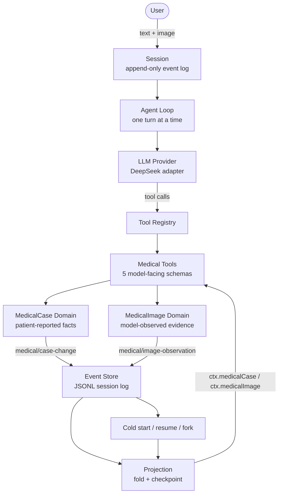
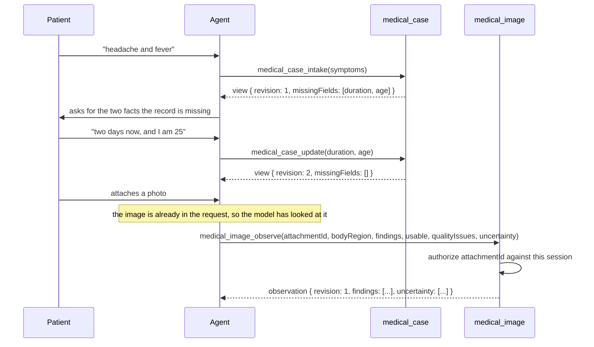

# MedHarness

一个通过**扩展 Agent 运行时**（而不是调用模型 API）构建出来的医疗接诊 Agent：两个事件溯源的领域服务、五个模型可见工具、一份只有五个工具的运行时 profile，以及一套轨迹级可靠性评测 —— 全部以插件形式挂载在 DeepSeek Harness 之上。

[English](README.md) | 中文

## 动机

把 LLM 硬接到临床流程上，会在四个很具体的地方失败，而这四处都不是模型质量的问题。

**状态不可靠。** 保存患者病例最顺手的去处就是对话本身。聊天消息没有 schema，所以无法校验；它从不断增长的对话记录里重新派生，所以一次压缩就会静默丢事实；而且它由模型写的次数和用户写的一样多，于是记录与模型对记录的复述互相漂移，却没有仲裁者。一个职责是**不**编造事实的 Agent，需要一份能证明自己的记录。

**多轮上下文会漂移。** 第五轮和第三轮矛盾，没人发现。没有修订号可比，没有事件可指，也无法追问「更正之前病例长什么样」。

**图片引用是错的。** 模型能看图之后，必须把标识发回来才能记录所见。实践中它发的是显示名、去掉前缀的摘要、文件系统路径 —— 唯独不是那个标识。能引用自己从未收到过的附件的 Agent 可以伪造证据；能引用别的会话附件的 Agent 可以跨租户读取。

**什么都验证不了。** 「我已记录您的症状和年龄」是一句零成本生成、也什么都证明不了的句子。真正要命的失败是静默的：回复很流畅，病例修订号没动，对话记录看起来一切正常。

MedHarness 对以上每一条都用结构性手段回答，而不是请求模型自觉：领域状态放进事件溯源投影，证据按「谁在说话」切分，附件身份对着会话授权，评测判定轨迹而不是回复。

## 架构



agent loop 没有被重写。DeepSeek Harness 提供 loop、会话日志、工具注册表、投影注册表与模型适配器；MedHarness 通过它本就公开的插件接缝实现领域能力，整个扩展也能在不改动运行时的前提下被摘掉。这次工作确实带来了一处对 harness 的源码级改动，值得说清楚：`dsh-llm` 里那段通用的、面向模型的图像 handle，现在把 attachment id 写成显式字段，因为真实模型无法可靠地照抄旧格式。那是对**一条共享投影路径**的改动，不是对 loop 的改动，而且是唯一的一处。

这张图要读成「两个环共用一根脊柱」：外环是对话，内环是持久性。完整走查见[架构页](../docs/medharness-architecture.zh.md)。

## Example Workflow

一次就诊前的接诊，从一句症状描述走到另一个系统可以读取的结构化记录。这是**结构化证据采集**，不是诊断：agent 收集患者陈述的内容、记录照片里可见的内容，这里没有任何东西产出临床结论。



这张图里有三件事才是重点。

**缺口报告驱动对话。** `medical_case_intake` 返回的是从记录算出的 `missingFields`，所以追问来自「什么还缺」而不是猜。当患者补上最后一个必填字段，列表清空，agent 就停止追问。

**病例与观察是两条记录、两个归属者。** 病例保存患者陈述的内容，观察保存模型看到的内容。后者永远不会变成前者 —— 没有任何参数能让它变，而且两者由不同的投影折叠。

**医疗领域与工具层从不直接接触图像字节。** 把图像送到模型面前的是 harness 的附件与 provider 流水线；`medical_image_observe` 只记录模型返回的结构化观察，并以会话授权的 attachment id 寻址。领域从不重读、重编码或存储任何图像。

下游读者拿到的不是一段对话记录，而是一份带修订号的病例记录，加上按附件寻址的观察 —— 两者都能由会话日志重放重建。

## 核心能力

**1. 医疗 Agent 运行时。** 一份独立 profile（`dsh --profile medharness`），它的整个模型可见面就是五个医疗工具。没有 shell、没有文件系统、没有联网搜索、没有 subagent、没有遥测 —— 不是被关掉，而是不存在。

| | `request/header.tools` 中的工具数 | tool schema 大小 |
|---|---|---|
| 跑在基础编码 bundle 之上 | **27** | 29,612 字节 ≈ **7,403 tokens** |
| `medharness` | **5** | 8,696 字节 ≈ **2,174 tokens** |

**2. 结构化医疗领域。** `medical-case` 为每个会话保存一份持久病例 —— 症状、持续时间、年龄、备注，以及单调修订号 —— 并在每次读取时派生 `missingFields`，让 Agent 去问缺失的内容而不是去推断。没有任何更新参数能清空字段，因此后续回答永远无法抹掉更早的那一条。

**3. 多模态观察流水线。** `medical-image` 记录模型在某张附加图像中直接看到的内容：部位、可见发现、一个带封闭枚举质量问题列表的 `usable` 判定，以及一个显式的 `uncertainty` 列表。附件对着会话自己的消息授权，因此模型无法引用一张从未附加给它的图像。

**4. 持久会话状态。** 两个领域都事件溯源进会话日志，并通过注册的投影读回。持久化、冷启动、resume 与 fork 继承都是这一点的推论，而不是外挂功能：重启后的进程重放日志即可重建相同状态，不需要迁移，也没有侧存储。

**5. 评测框架。** 黄金用例通过**真实** agent loop 回放 —— 只有模型是被脚本化的 —— 并按路由、病例状态、修订号、变更与工具错误来判定，而不是按 assistant 的散文判定。live 模式把同一份 roster 跑在交付组合上，如果它启动出来的运行时不是真正交付的那一个，它会拒绝报告数字。

## 工程难点

**附件接地。** 本项目最难的问题，也是背后有一条安全边界的那个。一次针对真实视觉模型的 live 运行，对**同一次** `medical_image_observe` 调用给出了四种不同答案 —— 显示名、去掉 `sha256:` 前缀的摘要、fixture id、归一化副本的文件系统路径 —— 四者全部被正确拒绝。修复分三层：身份由存储铸造（内容寻址，从不接受调用方断言），领域把被声称的 id 对着会话自己的消息授权，以及模型读到的那段 handle 被改写，让标识排在最前、带引号、保留前缀、并带字段名 —— 显示名则被显式标注为 display-only。六种近失身份各有测试要求被拒绝，同时 canonical id 仍须成功。

**事件 schema 演进。** 新增一个会话事件类型不是局部改动。生成的已知事件表、persistence catalog、schema 清单与已记录的兼容性历史必须一起移动，而读取路径是失败关闭的：本构建不认识的事件类型会拒绝整份日志，而不是跳过它。这个默认是对的 —— 静默丢掉一条权威领域记录会重建出错误的会话 —— 但它意味着一个缺失的生成条目会让本构建读不了自己写出的日志。确实发生过一次，修复是一行重新生成，外加一条记录在案的 `same-version` 兼容性决定。

**重放兼容性。** 每个变更事件携带**变更后的完整值**，从不携带增量，因此计算当前值永远不需要把增量与更早的 payload 合并 —— 这正是「后写覆盖」投影与严格重放能保持一致的原因。严格重放仍然按序号消费事件，因为单条快照无法独自承载全部不变量：产生该记录的操作、病例身份、修订号连续性、`createdAt` 顺序，都要对着前序事件校验。投影声明 `stateVersion`，来自更旧单元的持久检查点会被丢弃而不是向前套用。

**模型不确定性处理。** 把一张皮肤照片交给 LLM，它会给出诊断。系统不去声称能消除这件事，而是移除「结论会被写进」的那些字段：不存在 diagnosis、treatment、medication、risk、urgency、confidence 参数，并有测试断言永不添加。留下的是 `usable`（这张图无法评估）、封闭枚举的 `qualityIssues`，以及一个必填的 `uncertainty` 列表 —— 于是「我不知道」成为一种被记录的结果，而不是省略。

**组合出最小的面。** 这份 profile 是一棵独立树，不是把基础 bundle 的行关掉：做减法组合依然会安装、解析并版本化每一个编码 Agent 包。那次审计里有三个决定值得记下。**被别的行注入的行不是工具面** —— 进程约束与文件系统 provider 保留，因为别的行注入它们，但**不**声明任何 shell 或文件系统**工具**。**遥测无法从配置层面关闭**，所以整行不挂载而不是禁用；不挂载它的 profile 就不可能导出。**裸包名只有在 bundle 声明了它时才能解析**，因为模块回退走查镜像的是安装锚点的依赖闭包 —— 这就是该 bundle 的行使用包名而不是源码路径的原因。

## 评测

```sh
pnpm medharness:eval                                    # the three-case live smoke
pnpm medharness:eval --case get-reads-without-changing  # one named case
pnpm medharness:eval --all                              # the whole roster, images included
```

一次运行把各维度并排报出，而不是压成一个分数：

```text
profile=medharness provider=deepseek-official model=deepseek-flash runner=live
cases=1/1 passed routing=1/1 state=3/3 missingFields=1/1
image=6/6 imageMutation=3/3 unexpectedImageMutations=0
toolErrors=0 unexpectedMutations=0 timeouts=0 runtimeErrors=0
usage input=3519 output=1964 turns=1/1 complete=true
latency totalMs=13254
```

失败的运行会叫出失败的名字而不是把它藏起来 —— 分类、两个取值，以及可在持久日志里查到的会话序号：

```text
FAIL image-live-smoke-visible-patch
  turn 0: IMAGE_OBSERVATION_MISMATCH — the expectation describes an observation of
          "image-1", but this session holds none for that image
  turn 0: EXPECTED_IMAGE_MUTATION_MISSING — durable image change must be true; the turn produced false
```

离线套件是同一个 Evaluator，只是不接模型提供方：

```sh
pnpm vitest run packages/medical
```

每个机制的设计理由见[工程设计页](../docs/medharness-engineering-design.zh.md)。

## End-to-end Acceptance

下列行为今天都已被断言，每一条都有会在回归时失败的测试。冷启动与 catalog 两条是**在一次真实故障之后**补上的，详见[工程设计页](../docs/medharness-engineering-design.zh.md)。

| # | 行为 | 由谁断言 |
|---|---|---|
| T01 | **Persistence catalog** —— 每个已声明的领域事件都在生成的已知事件表里，因此构建能读它自己写的日志 | `packages/medical/medical-image/tests/persistence.spec.ts` |
| T02 | **冷 resume / 重放** —— 一个进程写下的会话被另一个进程打开、重放并 resume，状态完整保留 | `packages/medical/medical-image/tests/persistence.spec.ts` |
| T03 | **多图隔离** —— 同一会话里两张图保留两条互相独立的观察，各自寻址 | `golden/013-image-observe-two-images.json` |
| T04 | **只读不改** —— 读工具不动修订号，也不动日志 | `golden/007-get-reads-without-changing.json` |
| T05 | **相同快照是 no-op** —— 重复提交同一条观察不追加事件、不移动修订号 | `golden/011-image-observe-restatement-is-a-noop.json` |
| T06 | **全量快照更新** —— 变化的观察推进修订号，并记录完整的新值 | `golden/012-image-observe-update-advances-revision.json` |
| T07 | **附件授权** —— canonical id 成功；六种近失身份被拒绝，包括属于另一个会话的 | `packages/medical/medical-image/tests/service.spec.ts` |
| T08 | **低质量图像与不确定项** —— 无法评估的图被记成 unusable 并附质量问题，而不是靠猜 | `golden/010-image-observe-unusable-image.json` |

这些行为产生的持久流长这样。事件名与 payload 字段与代码写出的一致；序号是示意值，因为它取决于观察之前有多少轮。

```text
seq   1  turn/start
seq   2  user/message                 text + image block carrying the canonical attachment id
seq   3  tool/call                    medical_image_observe
seq   4  medical/image-observation    operation=observe  revision=1  findings=[...]  uncertainty=[...]
seq   5  tool/result                  changed=true

seq   N  tool/call                    medical_image_observe   (identical snapshot)
          -> no medical/image-observation record; revision stays 1; changed=false

seq   M  tool/call                    medical_image_observe   (changed snapshot)
seq   M  medical/image-observation    operation=update   revision=2  findings=[...]  uncertainty=[...]
```

这条时间线上有两个性质值得读出来。no-op **不能**只靠「没有记录」来断定 —— 也可能那次调用根本没发生。证据是三者合起来：有 `medical_image_observe` 调用、没有对应的 `medical/image-observation` 记录、修订号没有移动。T05 用例断言的正是这三条，这也是为什么变更期望检查的是事件条数，而不只是最终状态。而因为每条变更记录都是完整值，从更晚的记录计算当前观察永远不需要与更早的一条合并；严格折叠仍然要走一遍序列，去校验快照无法承载的那些不变量。

## 范围与非目标

若干大型子系统不被任何 bundle 挂载 —— SSH、browser-use、computer-use、desktop、`experimental/`、`benchmarks`、`website`、`native/system` —— 因此它们在运行时零成本。把它们从仓库中删除是一个体积决定，有自己的构建系统影响面；本项目没有删除任何东西。

这里没有任何东西做诊断、开处方或评估风险，而且设计刻意不给模型任何可以尝试的字段。这约束的是系统**存储并据以行动**的内容；它不能阻止模型在聊天句子里写下临床主张，本项目也不声称能。

## 仓库结构

| 路径 | 职责 |
|---|---|
| [`packages/medical/medical-case`](../packages/medical/medical-case/README.zh.md) | 患者陈述的病例领域及其投影 |
| [`packages/medical/medical-image`](../packages/medical/medical-image/README.zh.md) | 模型观察的图像领域及其投影 |
| [`packages/medical`](../packages/medical/README.zh.md) | 五个模型可见工具与分组地图 |
| [`packages/medical/medical-eval`](../packages/medical/medical-eval/README.zh.md) | 黄金用例、Evaluator、失败分类法、报告 |
| [`packages/bundle/medharness`](../packages/bundle/medharness/README.zh.md) | 运行时组合 —— 交付内容的唯一权威 |

## 开发备注

<details>
<summary>维护者工作上下文 —— 点击展开</summary>

本目录是项目首页。运行时组合住在 `packages/bundle/medharness`，是 profile 挂载内容的唯一权威；早先的原型曾以 `--patch` 覆盖层加一个测量脚本的形式放在这里，bundle 建成后两者都被移除 —— 因为两份权威会漂移，而 bundle 的测试断言的正是脚本当年只是打印出来的东西。

两个领域共享一个形状 —— 会话支撑、事件溯源、投影读取 —— 但不共享词汇，且刻意不合并。一个同时表示「患者说了这个」与「模型看到了这个」的单一事件，会抹掉「患者说了什么」与「模型看到了什么」之间的区分，而这正是整个设计所依赖的那条区分。

</details>
